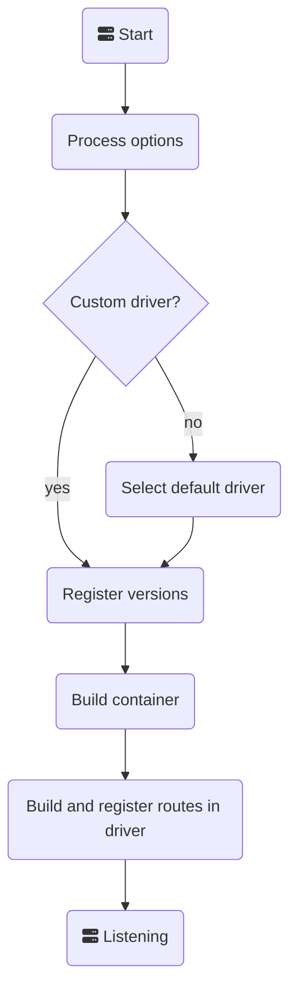
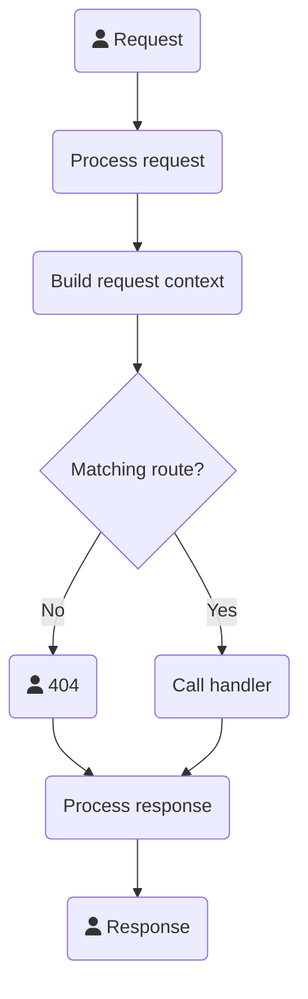

# Lifecycle

## Application Lifecycle

The following represents the application lifecycle:

## Request Lifecycle (core driver)

The following represents the request lifecycle for the core driver:

